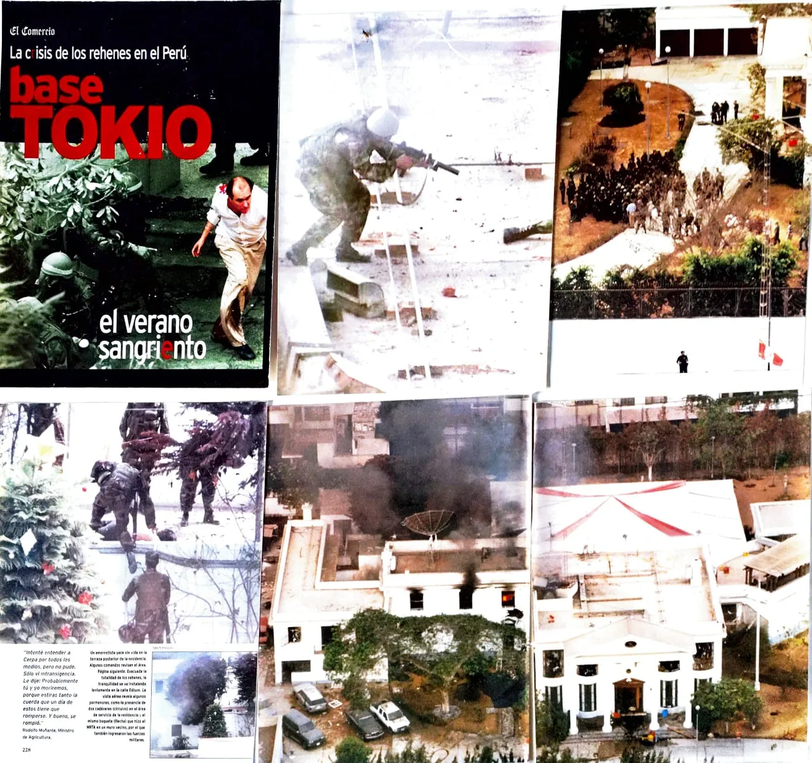
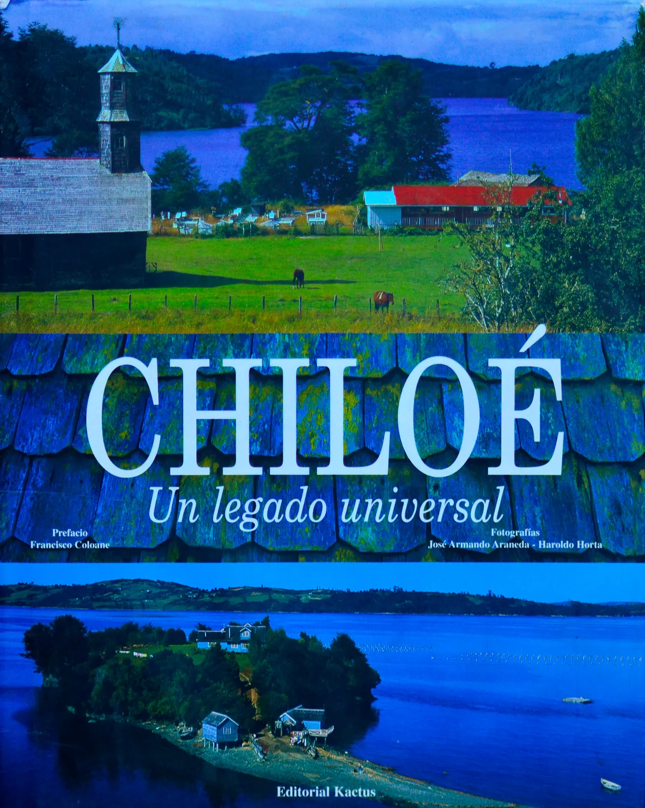
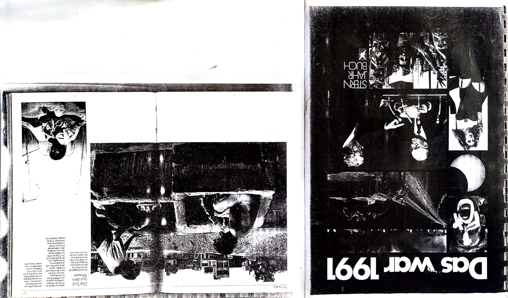
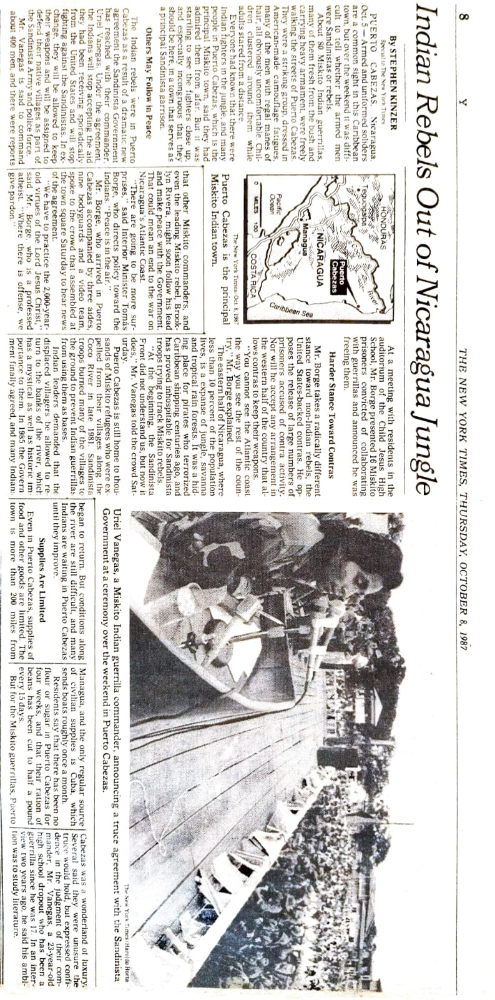
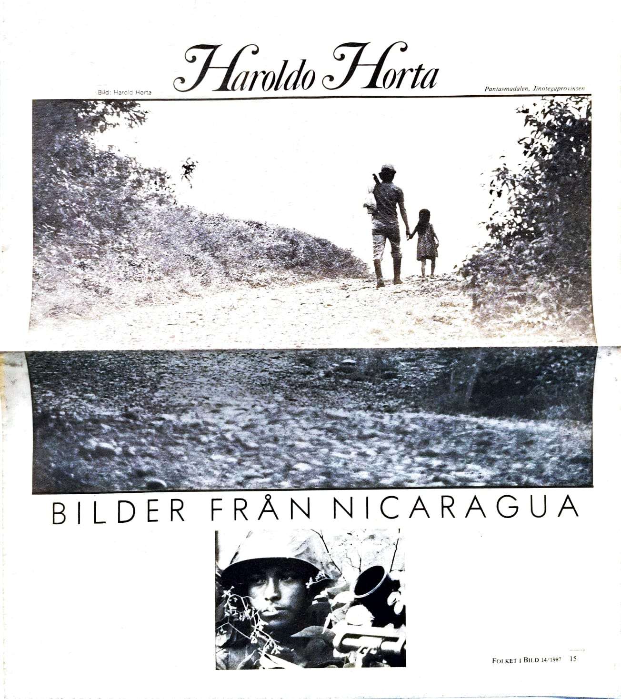
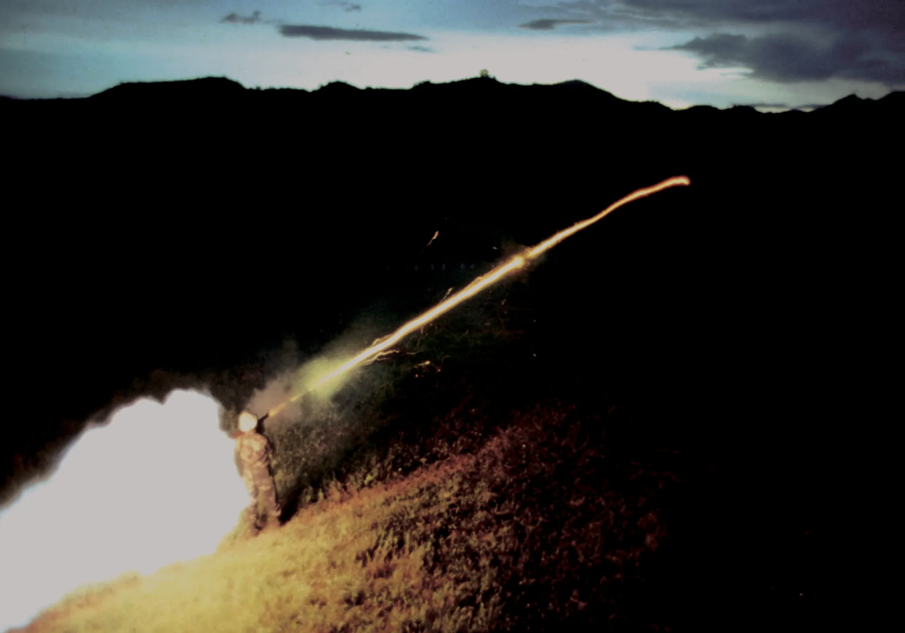
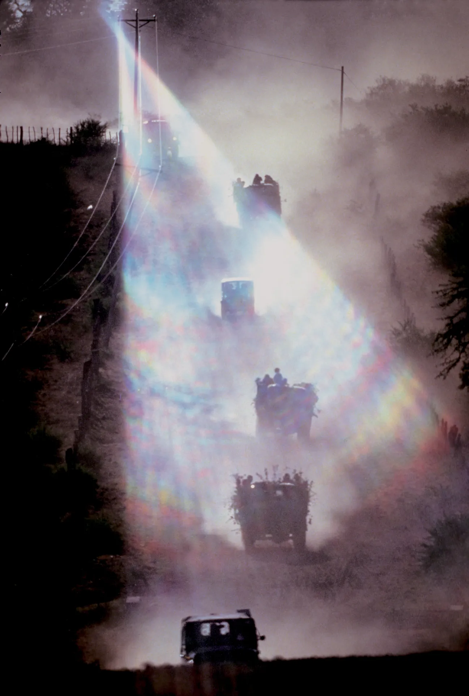
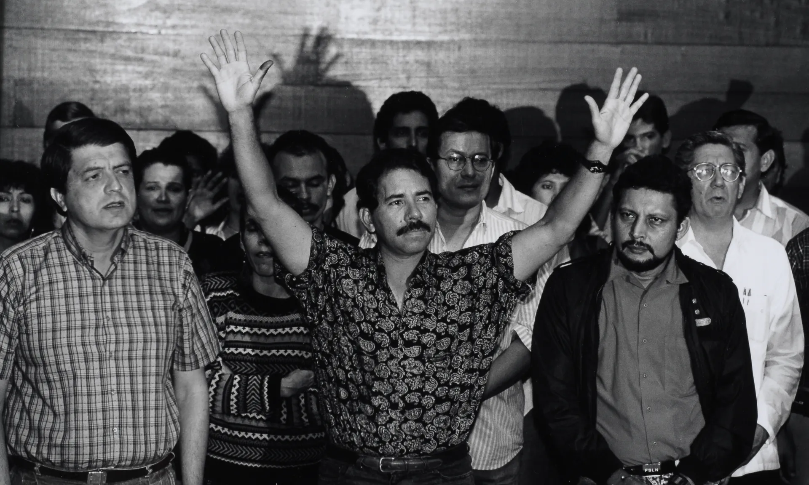

  <h1>📷 HAROLDO HORTA: ATLAS INTERACTIVO 📷</h1>
  <h3>50 Años de Memoria Viva / 50 Years of Living Memory</h3>
  
  
  
  

    <i>"De la trinchera al cielo: un registro ininterrumpido de la dignidad humana y la majestuosidad del territorio."</i>
  

  

    
    
  

  <h1><a href="https://tianhh77.github.io/vivevolandonomade/">🌍 ACCEDER AL ATLAS v3.2 (BETA) 🌍</a></h1>
  
  

    <a href="#-español"><b>🇪🇸 Español</b></a> | 
    <a href="#-english"><b>🇺🇸 English</b></a> | 
    <a href="#-português"><b>🇧🇷 Português</b></a>
  

---

## 🇪🇸 ESPAÑOL: El Manifiesto de una Vida

Este repositorio constituye el **Atlas Digital** de Haroldo Horta: 28TB de memoria fotográfica que documentan cinco décadas de historia global. Gestionado por el **Proyecto Surdao**, este archivo es un acto de **Rescate Narrativo**, resistencia cultural y salvaguarda patrimonial.

### 📜 Una Trayectoria en Tres Actos

#### I. El Corresponsal (1979 - 1997)
Documentó la Nicaragua Sandinista (sobreviviendo a la prisión política en 1979) y los conflictos sociales en Perú, integrando la plana mayor de la prensa europea como testigo de crisis que redefinieron el siglo XX.

#### II. La Luz del Fin del Mundo (1997 - 2022)
Haroldo trasciende la corresponsalía para conquistar el aire. Utilizando su **ultraligero** como plataforma tecnológica, define la iconografía geográfica de Chile (Editorial Kactus) y registra la soberanía nacional en la Antártida y faros remotos junto a la Armada de Chile.

#### III. El Vuelo Esencial (Presente)
El legado se digitaliza mediante un **Pipeline de Preservación Digital**. El enfoque evoluciona hacia el "vuelo libre" sobre el altiplano, capturando la esencia del territorio desde una perspectiva cenital única que hoy se organiza mediante algoritmos de dispersión matemática (Espiral de Fermat).

<table>
  <tr valign="middle">
    <td width="48%" align="center" style="border: none;">
      
      
<i>Operación Chavín de Huántar (1997).</i>

    </td>
    <td width="48%" align="center" style="border: none;">
      
      
<i>Editorial Kactus: Identidad visual de Chile.</i>

    </td>
  </tr>
</table>

---

## 🏛️ Validación y Prensa Internacional

| Medio / Agencia | Hito Histórico / Referencia |
| :--- | :--- |
| **Stern (Alemania)** | "Imágenes del Año" en el Anuario 1991. |
| **The New York Times** | Reportaje sobre la Paz Indígena Miskita, Nicaragua (1987). |
| **Der Spiegel** | Crónica visual "Das War 1991" y reportajes sobre la Pampa. |
| **La Nación / La Tercera** | [Haroldo Horta: El fotógrafo que vuela](https://www.pagina12.com.ar/diario/suplementos/turismo/9-3082-2015-05-10.html) |

---

## 🎞️ Dossiers Destacados: Memoria y Conflicto

### 📰 I. El Ojo de la Prensa Europea

<table>
<tr valign="middle">
<td width="33%" align="center" style="border: none;">

</td>
<td width="33%" align="center" style="border: none;">

</td>
<td width="33%" align="center" style="border: none;">

</td>
</tr>
</table>

### 🇳🇮 II. Nicaragua: El Sueño y la Caída

<table>
  <tr valign="middle">
    <td width="33%" align="center" style="border: none;">
      
    </td>
    <td width="33%" align="center" style="border: none;">
      
    </td>
    <td width="33%" align="center" style="border: none;">
      
    </td>
  </tr>
</table>

---

## 🇺🇸 ENGLISH: The Architecture of Memory

  

This digital repository hosts the professional legacy of **Haroldo Horta**. We are currently in the phase of **Narrative Rescue**, utilizing modern data engineering to reconnect the stories behind 1,500+ indexed frames—from Central American conflicts to the majesty of the Antarctic.

---

## 🇧🇷 PORTUGUÊS: Resumo do Arquivo

Este repositório contém o legado digital de **Haroldo Horta**. Como correspondente internacional e fotógrafo editorial, Horta registrou momentos cruciais da história latino-americana, unindo o rigor jornalístico à majestade do território através do voo livre.

---

## 🛡️ Blindaje del Legado y Propiedad
© 2026 Haroldo Horta / Proyecto Surdao. Todos los derechos reservados.
*Este Atlas es un organismo vivo en constante expansión. Cada imagen ha sido validada técnica y legalmente para asegurar su permanencia como patrimonio visual.*